# Code Institute, Milestone 3: HASHBOARD

## Introduction

In response to the financial crisis of 2008, Satoshi Nakamoto released the Bitcoin whitepaper outlining the first decentralised public ledger technology to hit the world stage.
The network has stood strong to this day and inspired 1000s of projects build off of Satoshi's vision of a decentralised world. We now have a robust ecosystem of smart contract, NFT and decentralised financed platforms.
Pandora's box has been opened and there is no turning back.

One of the main benefits of cryptocurrencies is the public availability of the blockchain data. Previously corporations would protect vast silos of data in order to monetize it & increase their stranglehold on the market.
Public blockchains granted software developers to the ability to compete with much larger corporations by providing value to the user & not by monetizing siloed data.

Even though cryptocurrencies have been around for more than a decade, adoption rates are still relatively low. I believe this is due to the perceived complexity of the technology.
My goal for my Code Institute Milestone Project 3: Data Centric is to simplify the experience for the user by allowing them to view their blockchain data in a more intuitive graphical interface.

#### The Ethereum Network

#### Current Blockchain Interfaces

This cryptocurrency dashboard project will be reading transactions from the Ethereum blockchain. Ethereum is the market leader in smart contract technology with the largest community & developer base.
Etherscan is the leading blockchain API which allows you to view transactions, smart contracts, user accounts & on-chain metrics. After using Etherscan for the past 4 years, I have seen that very few improvements have been made to the UX. 
I believe this is the key to onboarding new users and taking smart contract platforms to the next level.

### Future Features

This section will outline potential feature which I would like to add to the application in future.

#### Premium Subscription

#### Limit API requests

#### Metamask Integration

## Considerations

## UX

### Project Goals

My original idea was to introduce new people to the cryptocurrency ecosystem by creating a user-friendly interface to allow users to view their transactions in a more intuitive way.
This will allow users to view their blockchain transactions with more clarity & reduce some of the anxiety that new user will face when starting out in crypto.
This application doesn't just limit you to viewing your own transactions, the user will be able to search any transaction on the Ethereum chain and save it to their dashboard.
With this feature, users can track Ethereum whales & the movement of funds within important smart contracts. Many forensic accounting techniques can be preformed using this web application.

### User Goals

The target audience for this application reflects people within the age group of your average cryptocurrency user (16-35).

##### The user's goals are:

* To be provided with blockchain data in a format that is easy to navigate and understand.
* To use public blockchain data in order to track funds moving through the ecosystem.
* Prioritise specific transactions.
* Add small pieces of text to priority transactions.
* Update text related to priority transactions.

##### Hashboard satisfies these needs by:
* Creating a clean data layout with any unnecessary information removed.
* Allowing the user to search transactions from any public Ethereum address.
* Giving the user the ability to favourite priority transactions.
* The user is then able to add important text information related to that transaction.
* This information can be edited if it becomes outdated.
* Once a user is finished needing to view this transactions, their favourites list can be reset.

### Developer & Business Goals

This section will outline goals set out by application creator both in relation to how they would like to develop as a software engineer & their financial goals as regards to the website.

#### Developer Goals

* Due to this project being my first Python web application, my main goal was to learn as much as possible about Python web development.
* In the future, I would like to work as smart contract developer. This project, even though it doesn't use any smart contract, is a great project to have in my portfolio.
* To provide an application which is a useful tool to the crypto community.
* The application should also keep the user coming back regularly due to the necessity of the product.

#### Business Goals

* Use the application's traffic to sell advertising.
* (Future Feature) Create a premium tier account for heavy users.

##### Tier Structure

Limit the user to a set number of blockchain searches & favourited transactions. This will incentivise active users to upgrade to the premium tier.

Premium tier users will have unlimited access to search and adding favourite transactions.

### User Stories

1. As a user of this web application I want:
    * A clean and enjoyable UX, everything should be where I want it.
    * Fonts that are legible but something a bit different to the norm.
    * Little to no load times when the website first starts or has to complete a process.

2. As somebody looking to advertise on this website I would like:
    * Content that is family friendly and not provocative so our brand doesn't become tarnished.
    * Heavy user traffic in order to get our brand in front of as many eyeballs as possible.
    * Fast load times to ensure impatient users don't leave the site.

### Design Choices

#### Responsive Front-End Framework

For this project, I decided to use the Materialize framework which is build on the principles of material design.
After completing the project using this new framework, I can safely say that I prefer it more then Bootstrap which I have used on my previous 2 milestone projects.
It appears to provide more feedback to the user when they are navigating throughout the web application while remaining responsive on most devices.

#### Icons

All icons for this application have been sourced from [Google Fonts](https://fonts.google.com/icons) collected from the Material Icons library. As the designer of the web application, the selection of the icons must be done in line with other successful applications. 

##### Favourite Icon

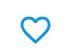

After searching a public Ethereum address, it's transactions will then be added to your hashboard. The next step is for the user to prioritise certain transactions which they deem important. The heart icon has been used for nearly a decade now in order to represent important items within a list.

##### Edit Icon

Once the user has added their priority transactions to their favourite's list, a text note may have been added. The edit icon is what allows the user to change the note stored in relation to their transaction. I have chosen the pen icon from Material Icons as it has been used by previous developers when interacting with text-based components. 

##### Delete Icon

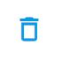

Finally, once the user has no more need to prioritise a specific transaction, there needs to be a way in order for the user to be able to clean up their favourite's list. There could only be one realistic choice for this icon as it has been used so predominantly in software design. I decided to use the rubbish bin icon due to it's intuitive nature.

#### Fonts

There has only been one font chosen for this project due to the nature of the application. I wanted to keep the application as minimal as possible. Only having one font, reduces complexity in the eye of the user leading to a more streamlined experience.

##### Varela Round

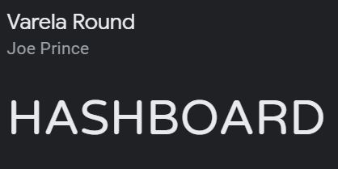

The font chosen was taken from [Google Fonts](https://fonts.google.com/). I chose this font as it was extremely legibile & simple while still remaining fun and playful.

#### Colours

The colour palate was chosen to emulate the design choices of the Ethereum foundation. Since it's inception, Ethereum's colour theme has always been different hues of blue. 

##### Teal lighten-2

This is the specific colour chosen within the Materialize framework for the navbar as it lends itself nicely to the Ethereum colour scheme.

##### Materialize Button

The colour of the buttons throughout the site is unchanged as it is the primary button colour for the Materialize framework. During the design process, I noticed that this shade of blue complemented the teal hue of the navbar.

## Key Frontend Design Elements

This section will outline the key elements within this application giving descriptions on the purpose of each element.

#### Modals

Modals have been used several times throughout the application in order to confirm if a user would like to proceed with an irreversible process. This is considered best-practice in web development as the user could easily push a button by mistake and trigger a process which cannot be undone.

As the majority of the web application is simply styled in order to create that sleek minimal look, modal design is where I have allowed for some more adventurous styling. As you can see in the example above, once a modal is activated, a shadow effect is applied across the screen behind the modal. A secondary teal shadow has been added to the border of the modal to give it a 3D-like appearance.

##### Log Out Modal Example

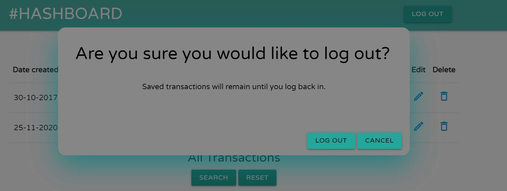

##### Sign Out Modal Example

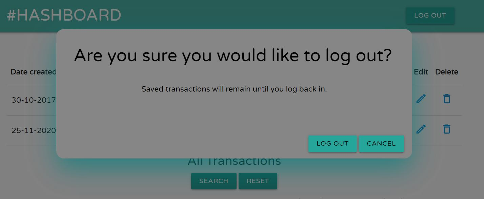

##### Reset Modal Example

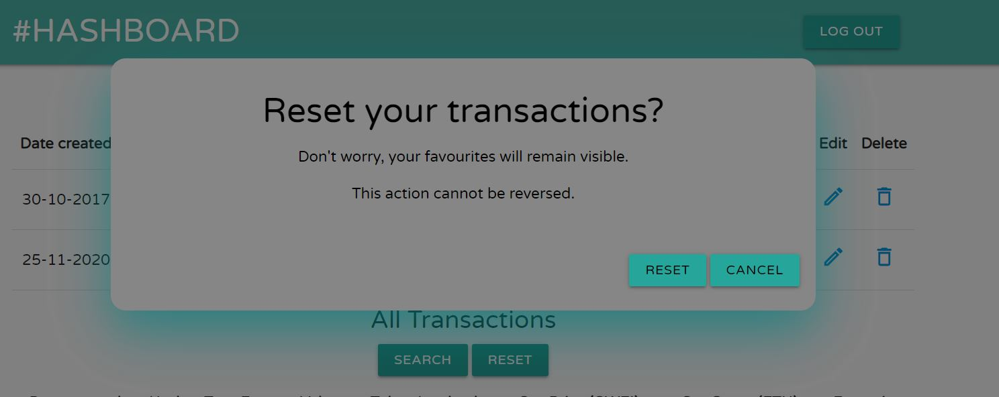

#### Data Tables(Desktop View)

For the desktop view, a data table was used to represent the Ethereum transaction data. Data tables allow more information to be displayed to the user without causing confusion. In order to aid this property, as much of the non-critical data has been removed.

#### Gallery Slider(Mobile/Tablet View)

From the beginning of the design of the application, I knew that a separate view would be needed to display transaction information to mobile/tablet users. The data table wouldn't be able to sufficiently show all data fields to the user in a satisfying manner.

In order to counteract this, a gallery style view was created for mobile/tablet users. Each transaction is represented by a slide within a larger gallery. Users swipe from left to right in order to access different transactions. I believe this is a design which many mobile users are familiar with due to the rise of social media applications such as Instagram.

### Error Handling

Within this application there are 2 levels of error handling:

1. Flash Messages notifies the user when:
    * Normal processes have occurred such as transactions being added or removed.
    * An incorrect password provided upon login.
    * An email address has already been used upon signup.
    * If the length of the Ethereum public address provided is incorrect.

2. Exceptions are displayed to the user when:
    * If the database query fails.
    * A user tries to access certain parts of the application without proper credentials.
    * The API response is incorrect or times out.

#### Flash Messages

In order to communicate information to the user, an alert system was needed. Flask has a built-in messaging library known as flash, which we can use to send important information to the frontend. Along with passing data, we can also categorise these messages into pre-defined groups such as "error" & "info". This allows us to change the styling of the HTML element displaying the alert depending on the category of the message.

###### Example of a successful flash message

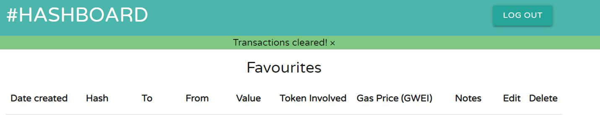

###### Example of an error flash message

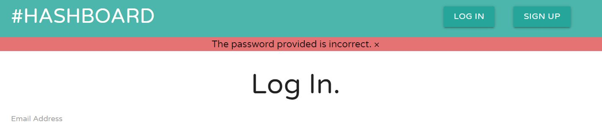

#### API Exceptions

During the development of this application, I decided to create a generic exception handler instead of creating specific exception handler for each type of exception. 
This way all possible Python subclasses of exception are covered. The user can then read the description of the exception in order to evaluate what went wrong.

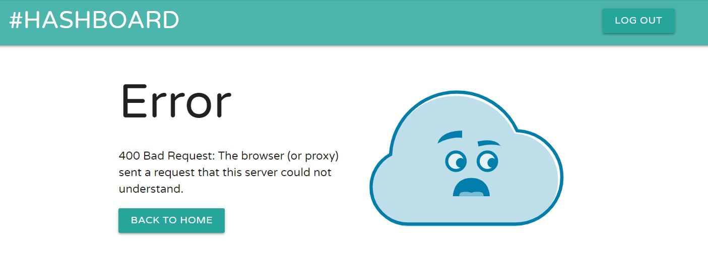

#### Other Low Level Exceptions

Other low level exceptions such as client-side errors (4xx) or server-side errors (5xx) will also be handled, describing to the user which error occurred. The user will also have an option to either return to their homepage or the login page depending on their credentials. 

#### Lottie Player Animations

Lottie provides lightweight animation hosting which provides significantly smaller footprint than conventional animations. 

### User Interaction

#### Blockchain Search

The blockchain search tools is the key component to the entire Hashboard application. Here, the users can add transactions related to any address within the public Ethereum ecosystem. During the Ethereum API decision-making process, there was 1 clear winner [Etherscan](https://etherscan.io/apis).
Etherscan is the leading blockchain explorer and has been around since Ethereum's inception.

#### Priority Transactions

Once transactions have been added from a specific Ethereum address we can then start to provide additional value which Etherscan itself doesn't provide. Users have the ability to prioritise specific transactions and additionally they can save important information which is related to that transaction.

#### Notes

Once the user has favourited a priority transaction, the user is given a text area where they can input information such as a description of the transaction or detailing the name belonging to the Ethereum public address. This feature could be used in order to do forensic accounting on the blockchain.

## Implementation

This section will outline the technologies & processes used in the design & implementation of this application.

#### Materialize Framework

For this project, the frontend framework I decided to use was Materialize. In my previous 2 milestone projects, I chose Bootstrap for the frontend, but I can now safely say that I much prefer the look of Materialize.
As it is based on the principles of material design, all elements just seem that little bit sharper and current.

#### MongoDB

For the backend on this application, MongoDB was chosen to implement the noSQL database as outlined in the assessment handbook.

##### MongoDB Atlas

MongoDB atlas is a cloud-based database service with a clean frontend client which allows you to see your collections evolve in real time.

##### MongoDB Schema Diagram

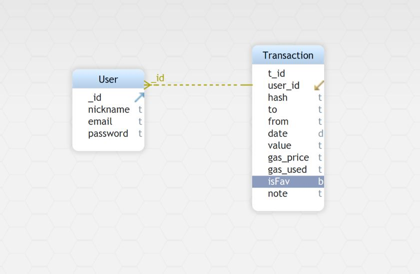

#### Etherscan API

The Etherscan Ethereum Developer APIs are provided as a community service and without warranty. Which means, that developers should be mindful in relation to how many calls their application is making. 
It supports both GET/POST requests and there is a rate limit of 5 calls per sec/IP.

#### Flask

Flask is a web application framework written in Python based on the Werkzeug toolkit & the Jinja2 templating language. During my development of this application is when I noticed the usefulness of flask, getting to experiment with the different flask libraries.

### Modules

#### API Requests

This application couldn't be possible without the Etherscan API request function, it is the basis of the entire website. The get_transactions() function within eth.py is in charge of the entire process, making three different API calls. One for standard Ethereum transactions, one for ERC-20 transactions & finally one for NFT transactions based on the ERC-721 standard.

These responses are then converted in json data, added to the database and combined into one consolidated list of transactions. This list can then be displayed to the user.

## Performance

#### Image Resizing & Compression

Due to the nature of the application, no image compression was needed as all design elements are from the Materialize framework. No images were used in the making of this application.

#### Lottie Player Animations

By using the Lottie animation player, we can bring beautiful animations into our application without having to worry about file size and hence performance. I have used a single hosted Lottie animation on the error.html page.

#### API Performance

###### Autoprefixing

NB NB NB NB

## Testing

### User Stories Testing

1. This application satisfies the needs of the user by:
    * Having a clean UI, based on the princibles of material design.
    * Ensuring that all text on the website is leigible at a quick glance.
    * Being designed in an efficent manner, compressing data wherever possible.

2. Advertiser needs are satisfied by this project as:
    * The site's content is advertiser-friendly and non-controvertial.
    * The web application is designed to maintain users attention by providing value.
    * The application is efficiently designed.

## Bugs Discovered

#### Index.html user Exception

## Dependancies

#### Requirements.txt

#### Web3

## Deployment

### Github Pages Deployment Procedure

This project was developed using Gitpod, committed to git and pushed to Github using the built-in function with Gitpod.

To deploy this page from Github pages from its Github repository, the following steps were taken.

1. Log into Github.
2. From the list of repositories on the screen, select saoirse-defi/milestone1-bad-arts-1.0.
3. From the menu items near the top of the page, select Settings.
4. Scroll down to the Github Pages section.
5. Under source click the drop-down menu labelled None and select Master Branch.
6. On selecting Master Branch, the page is automatically refreshed, the website is now deployed.
   
At the moment of submitting this milestone project, the default branch is version1.2 which is the latest version.

#### How to run this project locally:

To clone this project into Gitpod you will need:
1. A Github account
2. Use the Chrome browser

Then follow these steps:
1. Install the Gitpod browser extensions for Chrome
2. After installation, restart the browser
3. Log into Gitpod with your Gitpod account
4. Navigate to the Github project repository
5. Click the green 'Gitpod' button in the top right corner of the repository
6. This will trigger a new Gitpod workspace to be created from the code in Github where you can work locally

To work on the code within a local IDE such as VScode:
1. Follow this link to the Github repository
2. Under the repository name, click 'clone' or 'download'
3. In the clone with the https section, copy the clone URL for the repository
4. In your local IDE, open the terminal
5. Change the current working directory to the location where you want the cloned directory to be made.
6. Type 'git clone', and then paste the URL copied in step 3

git clone https://www.Github.com/USERNAME/REPOSITORY

7. Press enter. Your local clone will be created.

Further reading and troubleshooting on cloning a repository can be found here [Github](https://docs.Github.com/en/free-pro-team@latest/Github/creating-cloning-and-archiving-repositories/cloning-a-repository).

### Heroku Deployment Procedure

#### How to run your project on Heroku

Follow these steps:
1. Create a virtual environment with pipenv and install Flask and Gunicorn
2. Create a “Procfile” and write the following code "touch Procfile" in the command line
3. Create “runtime.txt” and write the following code "touch runtime.txt" in the command line
4. Create a folder named “app” and enter the folder
5. Create a python file, “main.py” and enter the sample code below

from flask import Flask
app = Flask(__name__)
@app.route("/")
def home_view():
        return "<h1>Welcome to Geeks for Geeks</h1>

6. Get back to the previous directory “eflask”.Create a file“wsgi.py” and insert the following code

from app.main import app
if __name__ == "__main__":
        app.run()

7. Run the vitual environment write "pipenv shell" in the command line.
8. Initialize an empty repo, add the files in the repo and commit all the changes
9. Login to heroku CLI using "heroku login"
10.  Create a unique name for your Web app, write "heroku create hashboard"
11. Push your code from local to the heroku remote using "git push heroku master"

## Credit

[Materialize Framework Documentation](https://materializecss.com/)

[HTML Element fade-out](https://stackoverflow.com/questions/1911290/make-div-text-disappear-after-5-seconds-using-jquery#1911308)

[Etherscan API](https://etherscan.io/apis)

[Flask Documentation](https://flask.palletsprojects.com/en/1.1.x/)

[Jinja Documentation](https://jinja.palletsprojects.com/en/3.0.x/)

[Werkzeug Documentation](https://werkzeug.palletsprojects.com/en/2.0.x/)

[Ethereum Documentation](https://ethereum.org/en/)

[Mongo DB Documentation](https://docs.mongodb.com/)

[Python Docstrings](https://www.geeksforgeeks.org/python-docstrings/)

[Pylint Error Help](https://learn.adafruit.com/improve-your-code-with-pylint/pylint-errors)

[Heroku Documentation](https://devcenter.heroku.com/categories/python-support)

[Markdown Cheat Sheet](https://www.markdownguide.org/cheat-sheet)

[Displaying Information to the user efficiently](https://www.youtube.com/watch?v=Ox9MW9Z8srE&list=PLOPo1bGrV4htxbQCS3CPZ59O1kpPdE7PK)

## Wireframes

###### Log In Page, Desktop

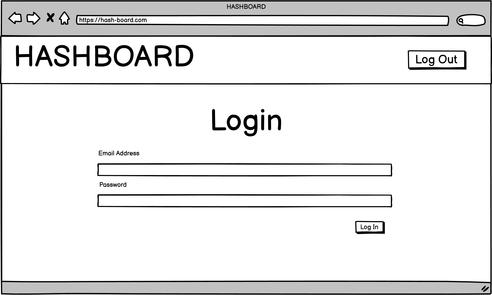

###### Log In Page, Mobile/Tablet

.png)

###### Sign Up Page, Desktop

.png)

###### Sign Up Page, Mobile/Tablet

.png)

###### Hashboard page, Desktop

.png)

###### Hashboard page, Mobile/Tablet

.png)

###### Search Page, Desktop

.png)

###### Search Page, Mobile/Tablet

.png)

###### Edit Page, Desktop

.png)

###### Edit page, Mobile/Tablet

.png)

